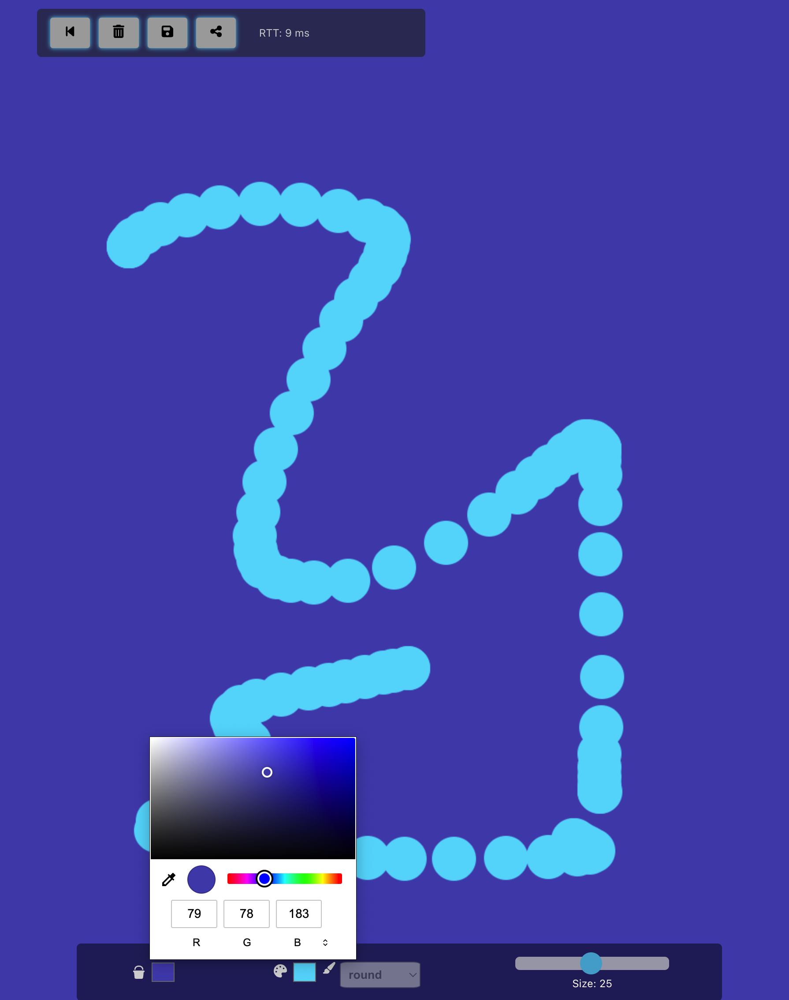

# Socket-Paint

### Description
Socket-Paint is collaborative drawing over websockets. It is a simple pixel art drawing app that allows users to draw on a shared canvas. The app is built with Node.js, Express, and Socket.io. The front-end is built with HTML, CSS, and vanilla JavaScript.

### Features
- Draw on a shared canvas
- Choose from a variety of colors
- Clear the canvas
- Save the canvas as an image
- Share the canvas with others
- See other users' drawings in real-time
- Share urls to invite others to draw with you

### Trying the App
[https://socketpaint.azurewebsites.net/](https://socketpaint.azurewebsites.net/)

